# 第一章  大数据概述

## 数据

### 数据的概念

**数据**是对**客观事物**的性质、状态以及相互关系进行记载的物理符号，是可识别的、抽象的。

数据也被称为**未来石油**

### 数据类型

常见类型为：

1. 文本
2. 图片
3. 音频
4. 视频

### 数据的组织形式

主要两种：

1. 文件：文件的文件名包括**主名**和**扩展名**，扩展名用来表示文件的**类型** 。在计算机系统中，很多数据都是以文件形式存在的。在计算机中，文件是由文件系统负责管理的。
2. 数据库：计算机系统中另一种非常重要的**数据组织形式**就是数据库。数据库已经成为计算机软件开发的**基础**和**核心**。人类已经经历了**层次数据库、网状数据库、关系数据库和NoSQL数据库**等多个数据库发展阶段。随着Web2.0的兴起，**非结构数据**迅速增加，目前人类社会产生的数字内容中有90%是非结构化数据。其中，**NoSQL数据库**能够更好地支持非结构化数据管理。

### 数据生命周期

数据都存在生命周期，数据的生命周期是指数据从**创建、修改、发布利用**到**归档或销毁**的整个过程。

数据生命周期管理工作主要包括：

+ 对数据进行**自动分类**，**分离**出**有效**的数据，对不同类型数据制定不同的管理策略，并及时清理无用的数据。
+ 构建**分层的存储系统**，满足不同类型的数据在不同生命周期阶段的存储要求，对关键数据进行数据备份保护。
+ 根据不同的数据管理策略，实施自动分层数据管理，即自动把不同生命周期阶段的数据存放在合适的存储设备上，提高数据的**可用性**和**管理效率**。

### 数据的使用

1. 数据清洗：把数据变成一个可用的状态
2. 数据管理：数据经过清洗过后，被存放到数据库系统中进行管理和使用
3. 数据分析：存储数据是为了更好地分析数据，分析数据需要借助于数据挖掘和机器学习算法。

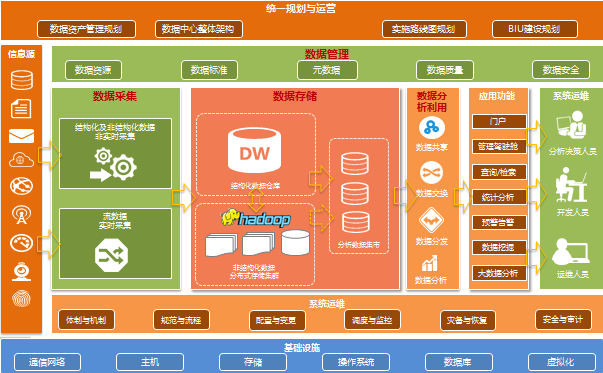

### 数据的价值

**数据的根本价值在于可以为人们找出答案**

大数据的核心价值，从业务角度出发，主要有如下的3点：

a.数据辅助决策：为企业提供基础的数据统计报表分析服务。分析师能够轻易获取数据产出分析报告指导产品和运营，产品经理能够通过统计数据完善产品功能和改善用户体验，运营人员可以通过数据发现运营问题并确定运营的策略和方向，管理层可以通过数据掌握公司业务运营状况，从而进行一些战略决策；

b.数据驱动业务：通过数据产品、数据挖掘模型实现企业产品和运营的智能化，从而极大的提高企业的整体效能产出。最常见的应用领域有基于个性化推荐技术的精准营销服务、广告服务、基于模型算法的风控反欺诈服务征信服务，等等

c.数据对外变现：通过对数据进行精心的包装，对外提供数据服务，从而获得现金收入。市面上比较常见有各大数据公司利用自己掌握的大数据，提供风控查询、验证、反欺诈服务，提供导客、导流、精准营销服务，提供数据开放平台服务，等等

### 数据爆炸

近年来，以大数据、物联网、人工智能、5G为核心特征的数字化浪潮正席卷全球，由此带来的车联网、工业物联网、人工智能生物识别带来的海量异构化数据，以及高带宽、低时延等新业务个性化需求，让传统的通用服务器及存储架构不堪重负。

## 大数据时代

-1603377638139.jpg)

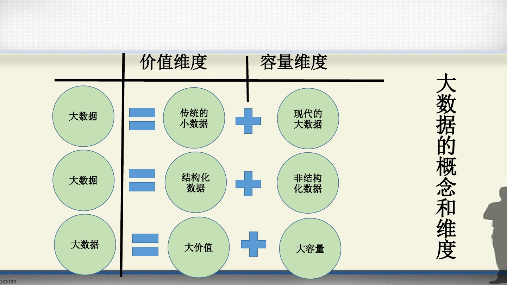

### 第三次信息化浪潮

根据IBM前主席执行路易斯·格斯特纳的观点，IT领域每隔15年就会迎来一次重大变革。

| 信息化浪潮 | 发生时间   | 标志                   | 解决问题 | 代表企业                                                     |
| :--------- | ---------- | ---------------------- | -------- | ------------------------------------------------------------ |
| 第一次浪潮 | 1980年前后 | 个人计算机             | 信息处理 | Intel、AMD、IBM、苹果、微软、联想、戴尔、惠普等              |
| 第二次浪潮 | 1995年前后 | 互联网                 | 信息传输 | 雅虎、谷歌、阿里巴巴、百度、腾讯等                           |
| 第三次浪潮 | 2010年前后 | 物联网、云计算和大叔级 | 信息爆炸 | 亚马孙、谷歌、IBM、VMWare、Palantir、Hortonworks、Cloudera、阿里云等 |

### 信息科技为大数据时代提供技术支撑

1. 存储设备容量不断增加
2. CPU处理能力大幅提升
3. 网络宽带不断增加

### 数据产生的变革促成大数据时代的来临

1. 运营式系统阶段
2. 用户原创内容阶段
3. 感知式系统阶段

### 数据的发展历程

| 阶段         | 时间                   | 内容                                                         |
| ------------ | ---------------------- | ------------------------------------------------------------ |
| 萌芽期       | 20世纪90年代至21世纪初 | 随着数据挖局理论和数据库技术的逐步成熟，一批商业智能工具和知识管理技术开始被应用，如数据仓库、专家系统、知识管理系统等 |
| 成熟期       | 21世纪前10年           | Web2.0应用迅猛发展，非结构化数据大量产生，传统处理方法难以应对，带动了大数据技术的快速突破，大数据解决方案逐渐走向成熟，形成了并行计算与分布式系统两大核心技术，谷歌的GFS和MapReduce等大数据技术受到追捧，Hadoop平台开始大行其道 |
| 大规模应用期 | 2010年以后             | 大数据应用渗透各行各业，数据驱动决策，信息社会智能化程度大幅提高 |

### 世界各国的大数据发展战略

| 国家 | 战略                                               |
| ---- | -------------------------------------------------- |
| 美国 | 稳步实施“三步走”战略，打造面向未来的大数据创新生态 |
| 英国 | 紧抓大数据产业机遇，应对脱欧后的经济挑战           |
| 法国 | 通过发展创新性解决方案并应用于实践来促进大数据发展 |
| 韩国 | 以大数据等技术为核心应对第四次工业革命             |
| 日本 | 开放公共数据，夯实应用开发                         |
| 中国 | 实施国家大数据战略，加快建设数字中国               |

### 大数据的概念

**4V** ：volume、variety、velocity、value

1. 数据量大
2. 数据类型繁多
3. 处理速度快
4. 价值密度低

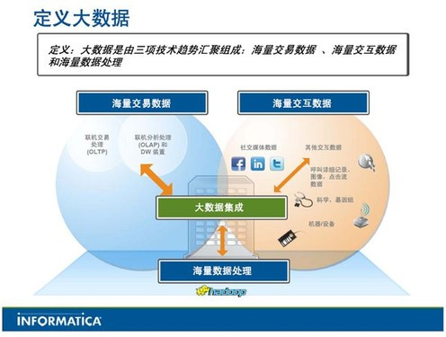

### 大数据的影响

#### 大数据对科学研究的影响

**大数据最根本的价值在于为人类提供了认识复杂系统的新思维和新手段**

人类科学研究上先后经历了实验、理论、科学和大数据4种范式

+ 实验科学
+ 理论科学
+ 计算科学
+ 数据密集型科学

#### 大数据对社会发展的影响

1. 大数据决策成为一种新的决策方式
2. 大数据成为提升国家治理能力的新途径
3. 大数据应用促进信息技术与各行业的深度交融
4. 大数据开发推动新技术和新应用的不断涌现

#### 大数据对就业市场的影响

大数据的兴起使得数据科学家成为热门专业

#### 大数据对人才培养的影响

### 大数据的应用

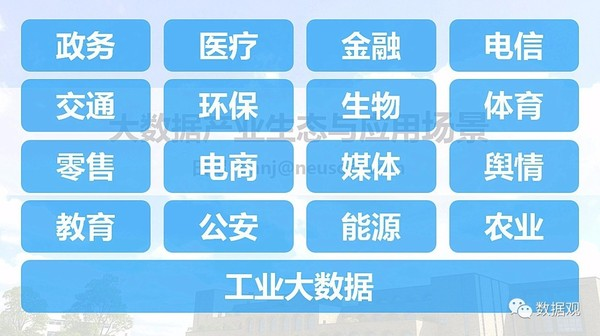

### 大数据产业

| 产业链环节   | 包含内容                                                     |
| ------------ | ------------------------------------------------------------ |
| IT基础设施层 | 包括提供硬件、软件、网络等基础设施以及提供咨询、规划和系统集成服务的企业，比如，提供数据中心解决方案的IBM、惠普和戴尔等，提供存储解决方案的EMC、提供虚拟化管理软件的微软、思杰、SUN、Redhat等 |
| 数据源层     | 大数据生态圈里的数据提供者，是生物(生物信息学领域的各类研究机构)大数据、交通(交通主管部门)大数据、医疗(各大医院 、体检机构)大数据、政务(政府部门)大数据、电商(淘宝、天猫、苏宁云商、京东等电商)大数据、社交网络(微博、微信、人人网等)大数据、搜索引擎(百度、谷歌等)大数据等各种数据的来源 |
| 数据管理层   | 包括数据抽取、转换、存储和管理等服务的各类企业或产品、如分布式文件系统(如Hadoop的HDFS和谷歌的GFS)、ETL工具(Informatica、Datastage、Kettle等)、数据库和数据仓库(Oracle、MySQL、SQL Server、HBase、GreenPlum等) |
| 数据分析     | 包括提供分布式计算、数据挖掘、统计分析等服务的各类企业或产品，如分布式计算框架MapReduce、统计分析软件SPSS和SAS、数据挖掘工具Weka、数据可视化工具Tableau、BI工具(MicroStrategy、Cogons、BO)等 |
| 层           |                                                              |
|              |                                                              |

# 第二章 大数据与云计算、物联网、人工智能

## 云计算

### 云计算的概念

1. 云计算实现了通过网络提供可伸缩的、廉价的分布式计算能力，用户只需要在具备网络接入条件的地方，就可以随时随地获得所需的各种IT资源。

2. 云计算包括3种典型的服务模式：**基础设施即服务（IaaS）、平台即服务（PaaS）和软件即服务（SaaS）。**

   

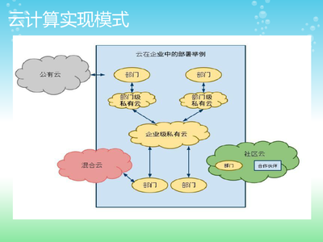

云计算包括公有云、私有云和混合云。

+ 公有云：面向所有用户提供服务，只要注册付费的用户都可以使用
+ 私有云：只为特定用户提供服务，比如大型企业出于安全考虑自建的云环境，只为企业内部提供服务
+ 混合云：综合公有云和私有云的特点，对于一些企业而言，一方面出于安全考虑需要把数据放在私有云中，另一方面又希望可以获得公有云的计算资源，为了最佳效果，就把可以公有云和私有云进行混合搭配使用。

### 云计算数据安全中心

当使用云计算服务商提供的云储存服务把数据保存在“云端”时，最终数据会被存放在哪里呢？"云端"只是一个形象的说法，这些云端的数据实际上是被保存在全国各地修建的大大小小的**数据中心**。

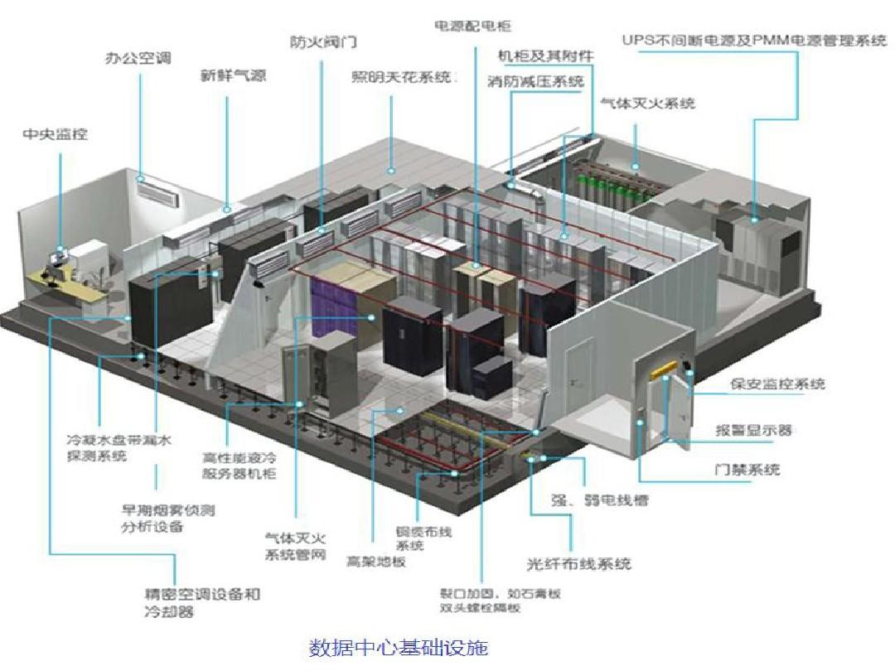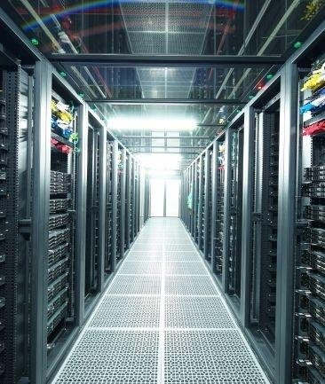

### 云计算的应用

**1. IDC云**

IDC云是在IDC原有数据中心的基础上，加入更多云的基因，比如系统虚拟化技术、自动化管理技术和智慧的能源监控技术等。通过IDC的云平台，用户能够使用到虚拟机和存储等资源。还有，IDC可通过引入新的云技术来提供许多新的具有一定附加值的服务，比如，PaaS等。现在已成型的IDC云有Linode和Rackspace等。

**2. 企业云**

企业云对于那些需要提升内部数据中心的运维水平和希望能使整个IT服务更围绕业务展开的大中型企业非常适合。相关的产品和解决方案有IBM的WebSphere CloudBurst Appliance、Cisco的UCS和VMware的vSphere等。

**3. 云存储系统**

云存储系统可以解决本地存储在管理上的缺失，降低数据的丢失率，它通过整合网络中多种存储设备来对外提供云存储服务，并能管理数据的存储、备份、复制和存档，云存储系统非常适合那些需要管理和存储海量数据的企业。

**4. 虚拟桌面云**

虚拟桌面云可以解决传统桌面系统高成本的问题，其利用了现在成熟的桌面虚拟化技术，更加稳定和灵活，而且系统管理员可以统一地管理用户在服务器端的桌面环境，该技术比较适合那些需要使用大量桌面系统的企业。

**5. 开发测试云**

开发测试云可以解决开发测试过程中的棘手问题，其通过友好的Web界面，可以预约、部署、管理和回收整个开发测试的环境，通过预先配置好（包括操作系统，中间件和开发测试软件）的虚拟镜像来快速地构建一个个异构的开发测试环境，通过快速备份/恢复等虚拟化技术来重现问题，并利用云的强大的计算能力来对应用进行压力测试，比较适合那些需要开发和测试多种应用的组织和企业。

**6. 大规模数据处理云**

大规模数据处理云能对海量的数据进行大规模的处理，可以帮助企业快速进行数据分析，发现可能存在的商机和存在的问题，从而做出更好、更快和更全面的决策。其工作过程是大规模数据处理云通过将数据处理软件和服务运行在云计算平台上，利用云计算的计算能力和存储能力对海量的数据进行大规模的处理。

**7. 协作云**

协作云是云供应商在IDC云的基础上或者直接构建一个专属的云，并在这个云搭建整套的协作软件，并将这些软件共享给用户，非常适合那些需要一定的协作工具，但不希望维护相关的软硬件和支付高昂的软件许可证费用的企业与个人。

**8. 游戏云**

游戏云是将游戏部署至云中的技术，目前主要有两种应用模式，一种是基于Web游戏模式，比如使用JavaScript、Flash和Silverlight等技术，并将这些游戏部署到云中，这种解决方案比较适合休闲游戏；另一种是为大容量和高画质的专业游戏设计的，整个游戏都将在运行云中，但会将最新生成的画面传至客户端，比较适合专业玩家。

**9. HPC云**

HPC云能够为用户提供可以完全定制的高性能计算环境，用户可以根据自己的需求来改变计算环境的操作系统、软件版本和节点规模，从而避免与其他用户的冲突，并可以成为网格计算的支撑平台，以提升计算的灵活性和便捷性。HPC云特别适合需要使用高性能计算，但缺乏巨资投入的普通企业和学校。

**10. 云杀毒**

云杀毒技术可以在云中安装附带庞大的病毒特征库的杀毒软件，当发现有嫌疑的数据时，杀毒软件可以将有嫌疑的数据上传至云中，并通过云中庞大的特征库和强大的处理能力来分析这个数据是否含有病毒，这非常适合那些需要使用杀毒软件来捍卫其电脑安全的用户。

### 云计算产业

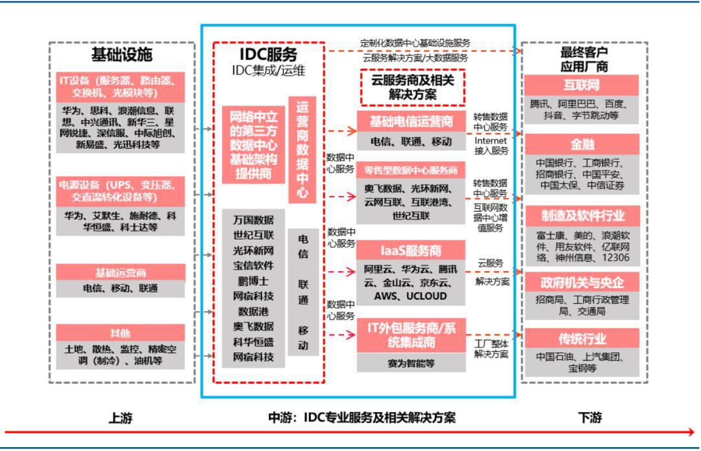

## 物联网

### 物联网的概念

物联网是物物相连的互联网，是互联网的延伸，它利用**局部网络或互联网**等通信技术把**创感器、控制器、机器、人员和物**等通过新的方式连在一起，形成人与物、物与物相连，实现信息化和远程管理控制。

从技术架构上来看，物联网可分为4层：**感知层、网络层、处理层和应用层**。

.jpg)

| 层次   | 功能                                                         |
| ------ | ------------------------------------------------------------ |
| 感知层 | 负责信息采集和物物之间的信息传输，信息采集的技术包括传感器、条码和二维码、 RFID射频技术、音视频等多媒体信息，信息传输包括远近距离数据传输技术、自组织组网技术、协同信息处理技术、信息采集中间件技术等传感器网络。感知层是实现物联网全面感知的核心能力，是物联网中包括关键技术、标准化方面、产业化方面亟待突破的部分，关键在于具备更精确、更全面的感知能力，并解决低功耗、小型化和低成本的问题。 |
| 网络层 | 相当于人体的神经中枢，起到信息传递的作用。网络层包括各种类型的网络，如互联网、移动通信网络、卫星通信网络等 |
| 处理层 | 相当于人体的大脑，起到存储和处理的作用，包括数据存储、管理和分析平台 |
| 应用层 | 直接面对用户，满足各种应用需求，如智能交通、智慧农业、智慧医疗、智能工业等 |

### 物联网的关键技术

1. 识别和感知技术：二维码、RFID以及各种传感器
2. 网络与通信技术
3. 数据挖掘与融合技术

### 物联网的应用

+ 智能交通
+ 智慧医疗
+ 智能家居
+ 环保监测
+ 智能安防
+ 智能物流
+ 智能电网
+ 智慧农业
+ 智能工业

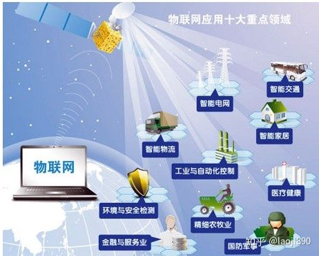

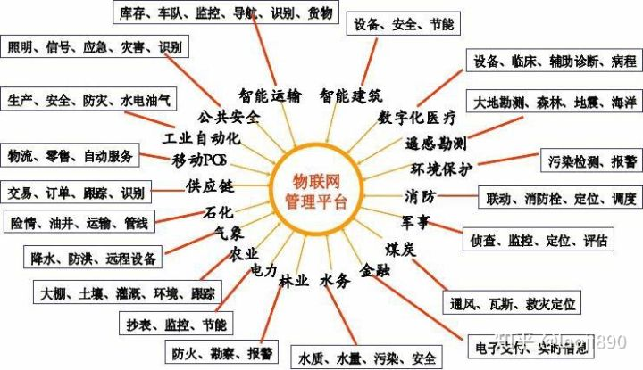

### 物联网产业

+ 核心感应器件提供商：提供二维吗、RFID及读写工具、传感器、智能仪器等物联网核心感应器件。
+ 感知层末端设备提供商：提供射频识别设备、传感系统设备、智能控制系统及设备、GPS设备、末端网络产品等。
+ 网络提供商：包括电信网络运营商、广电网络运营商、互联网运营商、卫星网络运营商和其他网络运营商等。
+ 软件与行业解决问题方案提供商：提供微操作系统、中间件、解决方案等。
+ 系统集成商：提供行业应用集成服务。
+ 营运及服务提供商：开展行业物联网运营及服务。

## 大数据与云计算、物联网的关系

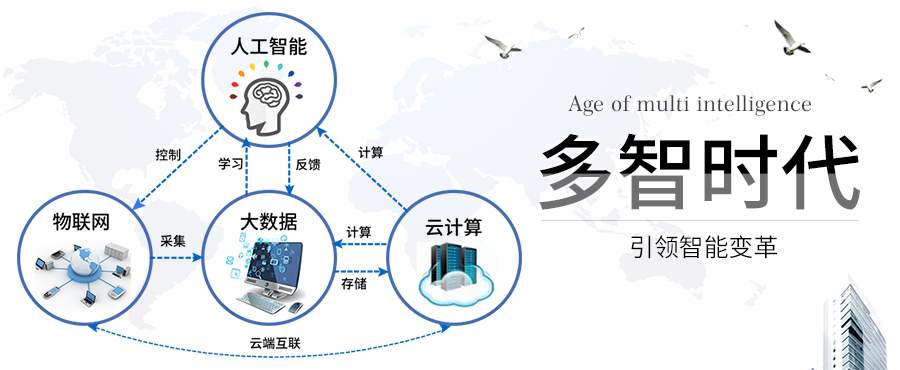

## 人工智能

### 人工智能的概念

人工智能：是研究、开发用于模拟、延伸和扩展人的智能的理论、方法、技术及应用系统的一门新的技术科学。

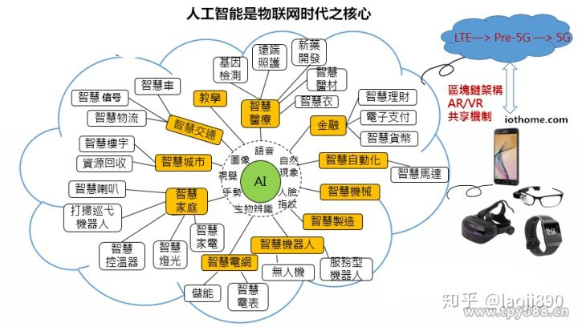

### 人工智能的关键技术

1. 机器学习
2. 知识图谱
3. 自然语言处理
4. 人机交互
5. 计算机视觉
6. 生物特征识别
7. VR/AR

### 人工智能的应用

1. 智能制造
2. 智能家居
3. 智能金融
4. 智能交通
5. 智能安防
6. 智能医疗
7. 智能物流
8. 智能零售

### 人工智能产业

1. **智能基础设施建设**：为人工智能产业提供计算能力支撑，其范围包括**智能传感器、智能芯片、分布式计算框架**等，是人工智能产业发展的重要保障。
2. **智能信息及数据**
3. **智能技术服务**
4. **智能产品**

## 大数据与人工智能的关系

大数据和人工智能被数据科学家或其他大公司视为两个机械巨人。许多公司认为人工智能将给他们的公司数据带来革命。机器学习被认为是人工智能的高级版本，通过它，各种机器可以发送或接收数据，并通过分析数据学习新的概念。 **大数据帮助组织分析现有数据，并从中得出有意义的见解。**

# 第三章  大数据技术